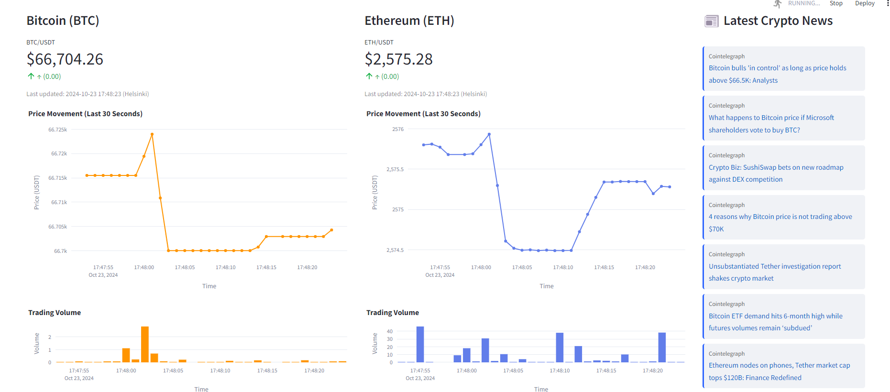
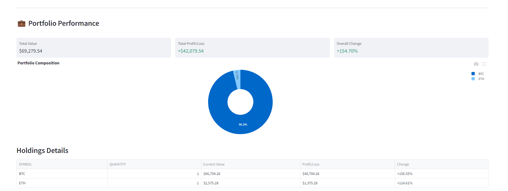

# Real-time Cryptocurrency Data Platform
This project builds a real-time cryptocurrency tracking system which combines streaming data processing for live price updates with batch ingestion of daily news. This platform provides real-time price monitoring, portoflio tracking and news update using an interactive dashboard. 

## Architecture

The above diagramm demonstrates the architecture of this system. 

**Ingestion Layer**: This layer is divided into 2 components, each responsible for a different load type for data. 
- Streaming ingestion: the `snowpipe_streaming` directory includes a CloudFormation template to deploy the EC2 instance running Linux server and an AWS MSK cluster. Neccesary properties scripts and execution steps to initiate the streaming system can be found in `snowpipe_streaming/scripts/`. 
- Batch ingestion: the `snowpipe_batch` directory includes a CloudFormation template to deploy an AWS Lambda function and the EventBridge event rules for automated batch ingestion. The `snowpipe_batch/resource` directory contains neccesary dependencies for the Lambda function, configuration on Snowflake to create Snowpipe for ingesting batch data from S3 to Snowflake. 

**Processing Layer**: The `data_processing` directory contains processing scripts for both types of data loaded. 
- Streaming processing: proccessing raw streaming data using Snowflake view. 
- Batch processing: processing raw batch data using Snowflake's procedure and task.  

**Data Warehousing Layer**: A Snowflake database stores and persist all raw data recieved from Kafka (streaming) and S3 (batch). 

**Visualization Layer**: A Streamlit app running on local machine which connect to Snowflake and gather neccesary data for the dashboard. The `app.py` used different helper functions from `scripts` directory to run and compile the dashboard. 

## Dashboard

## Setup and Deployment
This Github repo contains all neccessary scripts and execution steps to deploy all components together or individually. However, the very first step should always be getting the Finnhub API token by creating a Finnhub account.

Next, an account on AWS and Snowflake are required since the ingesting, processing and storing processes are done on these 2 cloud services.

To deploy the pipelines for streaming and batch, follow the `snowpipe_streaming` and `snowpipe_batch` directories respectively. The processing layer can be configured using scripts on `data_processing` directory. To run the dashboard, a virtual python environment was created and neccesary dependicies are stored in `requirements.txt`. Activate the virtual environment and run the `app.py` should open a web browser which demonstrates the dashboard. 
## Potential Improvements
- Developing CI/CD pipeline which allows automated deployment and reduce the need for manual integration when there is new update. 
- Optimize EC2 feature in UserData in deploying neccesary scripts inside the EC2 server right after it is created by CloudFormation.
- Developing an orchestration tool to manage the pipeline process.
